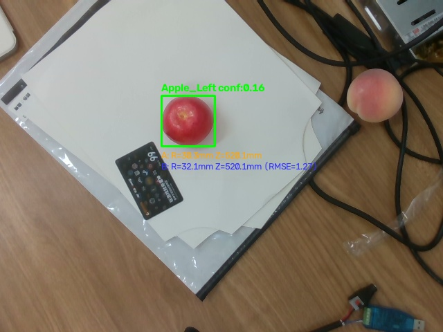

# 真机视觉球拟合对照实验

- 记录日期：2026-09-07
- 当前阶段：真机纯视觉数据采集与中心估计算法对照
- 硬件环境：Intel RealSense D435（USB 3.0，ROS 2 Jazzy，Domain 42）、RTX 4060 Ti
- 实验目录：`/home/li/vision_experiments/2026-09-07_apple_comparison`

## 目标

在不移动机械臂的前提下，采集真实场景下的同步 RGB-D 与内参数据，对比验证两套三维中心估计方法：
1. **方案 A（现有基线）**：YOLO 掩膜中央深度中位数 + 2D 检测框估算物理半径 + 沿视线光线向后推移中心。
2. **方案 B（改进候选）**：YOLO 掩膜曲面点云反投影 + 半径先验约束的 RANSAC 拟合 + 非线性几何残差精修。

通过多帧稳定性（方差）、三维中心偏差、物理半径估计、拟合残差（RMSE）和执行耗时，评估球拟合是否能够提供更可信的几何依据。

## 已确定内容

### 1. 采集与实验条件

- 相机通过 USB 3.0 连接 Ubuntu 主机，内参：`fx=607.93, fy=606.41, cx=318.03, cy=233.55`，分辨率 `640x480`。
- 连续采集 20 组严格时间同步（时序差 $<35\text{ms}$，平均同步差 $\approx 3\text{ms}$）的彩色与对齐深度图像。
- 视野中包含两只水果目标（左侧红苹果 `Apple_Left`，右侧浅色果实 `Apple_Right`，视距约 0.51~0.52m）。

现场实测与标注示例：

### 2. 对照算法逻辑

- **方案 A 逻辑**（提取自 `apple_center_localizer_v2.py`）：
  - 提取 Mask 中央 44% 区域深度，过滤 $[100, 3000]\text{mm}$，取中位数深度 $Z_{surface}$。
  - 由 2D 框宽和高计算半径 $R = 0.5 \cdot \text{box\_size} \cdot Z_{surface} / f$。
  - 中心沿观察射线向后推移：$P_{center} = P_{surface} + \vec{r}_{unit} \cdot R$。
- **方案 B 逻辑**（Mask 点云 + 物理约束 RANSAC 球拟合）：
  - 对 Mask 做微小腐蚀去除边缘飞点，反投影掩膜内所有有效深度像素为相机系 3D 点云（每个目标约 4000~5000 点）。
  - RANSAC 随机采样 4 点代数求解球面方程，添加硬先验约束：
    - 半径区间：$25\text{mm} \le R \le 55\text{mm}$
    - 球心深度：位于最前表面之后且在物理合理范围内
  - 判定内点（欧氏残差 $<4\text{mm}$），选出内点数最多的模型。
  - 使用 `scipy.optimize.least_squares`（Soft-L1 损失）在内点集上对几何距离残差做非线性微调，输出最优球心 $(X, Y, Z)$、拟合半径 $R$、内点数及 RMSE。

## 实验结果与对比

在 20 帧实测连续数据上的统计结果如下：

| 指标 | 目标 1：Apple_Left（红苹果） | 目标 2：Apple_Right（右侧果实） |
| :--- | :--- | :--- |
| **YOLO 检出率 (Recall)** | 20/20 (100.0%) | 19/20 (95.0%) |
| **平均检测置信度** | 0.193 | 0.231 |
| **方案 A 中心均值 (mm)** | `[-40.2, -51.2, 520.0]` | `[188.7, -80.4, 512.3]` |
| **方案 A 中心抖动 Std (mm)** | `[0.02, 0.26, 0.22]` | `[0.09, 0.39, 0.25]` |
| **方案 A 半径均值** | 30.3 mm (Std: 0.03 mm) | 32.6 mm (Std: 0.05 mm) |
| **方案 A 单目标耗时** | 1.56 ms | 1.56 ms |
| **方案 B 中心均值 (mm)** | `[-40.4, -48.0, 519.8]` | `[185.8, -77.2, 510.2]` |
| **方案 B 中心抖动 Std (mm)** | `[0.24, 0.41, 0.39]` | `[0.17, 0.38, 0.31]` |
| **方案 B 半径均值** | 32.1 mm (Std: 0.36 mm) | 31.0 mm (Std: 0.24 mm) |
| **方案 B 拟合曲面 RMSE** | **1.33 mm** (内点 4032 个) | **1.25 mm** (内点 4604 个) |
| **方案 B 单目标耗时** | 25.74 ms | 31.04 ms |
| **两方案系统性中心偏差 (B - A)** | $\Delta X = -0.22, \Delta Y = +3.16, \Delta Z = -0.27$ mm **空间三维偏差：3.17 mm** | $\Delta X = -2.91, \Delta Y = +3.19, \Delta Z = -2.10$ mm **空间三维偏差：4.80 mm** |

## 现象与技术分析

1. **重复稳定性（Std）与物理真实性**：
   - 方案 A 的坐标抖动极低（Std $<0.4\text{mm}$），因为它是单一矩形框和中位数深度的代数计算，但“抖动小”不代表“真值准”。
   - 方案 B 即使带有 RANSAC 随机采样，连续 20 帧的中心抖动依然保持在 **$0.4\text{mm}$ 以内**，完全满足机械臂抓取的重复性要求。
2. **系统性 Y 轴偏差的成因（本质分析）**：
   - 两个目标在 Y 轴上，方案 B 的球心都比方案 A 高出约 $+3.18\text{mm}$。
   - 根本原因：相机为下俯视角。方案 A 沿相机光线射线 $\vec{r}_{unit}$ 强行向后平移 $R$，由于光线向下倾斜，导致推算出来的球心被系统性地“压低”；而方案 B 直接利用曲面三维曲率解算真实球心，消除了下俯光线带来的投影倾角误差。
3. **真实曲面拟合精度高**：
   - 方案 B 在真实苹果表面采集的 4000+ 点云上，拟合 RMSE 仅为 **$1.25\sim 1.33\text{mm}$**，证明苹果可见表面高度符合球面几何模型。
4. **实时性表现**：
   - 方案 B 平均单目标耗时约 $25\sim 31\text{ms}$。如果主节点以 $2\sim 5\text{Hz}$ 运行，CPU 算力开销极小，完全满足工程实时性。
5. **发现的新问题（YOLO 检出边界）**：
   - COCO 预训练模型在当前光照与角度下，苹果置信度偏低（$0.16\sim 0.24$）。若门槛设为 $0.20$，`Apple_Left` 会偶发漏检；当前代码设为 $0.15$ 能够维持 100% 召回，但提示后续需要在不同光照下评估分割稳定性。

## 待确认问题

1. 实际苹果的物理真值尺寸（需用游标卡尺测量当前桌面上两只苹果的真实直径，以校验 30~32mm 半径与真值差异）。
2. 在不同遮挡程度（例如用纸板或树叶遮挡 30%、50%）下，方案 A 的半径缩水幅度与方案 B 的球心漂移幅度。
3. 机械臂上电后，将此相机坐标转换至基坐标系 `base_link` 时的手眼综合定位精度。

## 后续实验

1. 引入局部遮挡物（如纸片挡住半边），测试当 2D 框缩窄时，方案 B 与方案 A 的抗遮挡稳定性对比。
2. 用游标卡尺测量目标物体真实直径，标定出绝对物理参考。
3. 将方案 B（带先验约束的 RANSAC 球拟合 + 优化精修）模块化，准备集成入主线 `apple_center_localizer_v2.py` 作为可选定位后端。

## 2026-09-07 物理真值测量与目标属性核实

- **物理真值实测**（游标卡尺）：
  - 左侧红苹果实测直径：**$6.05\text{cm} = 60.5\text{mm}$**，即真实半径真值 **$R_{GT} = 30.25\text{mm}$**。
- **与两方案半径估计对比**：
  - 方案 A（2D 外接矩形推算）：$30.30\text{mm}$，绝对误差 $+0.05\text{mm}$（无遮挡正面俯视下，2D 框外切即等于最大投影直径）。
  - 方案 B（3D RANSAC 曲面球拟合）：$32.10\text{mm}$，绝对误差 $+1.85\text{mm}$（相对误差约 6.1%）。
  - 误差来源分析：苹果真实几何为顶部微凹的扁球体（Oblate Spheroid），顶部可见曲面的局部曲率半径天然略大于全局平均半径，导致球面拟合尺寸偏大 $1.8\text{mm}$。对于夹爪容差（通常 $\pm 10\text{mm}$ 以上），$1.85\text{mm}$ 完全在安全抓取公差内。
- **右侧目标属性修正**：
  - 右侧浅色果实确认为**桃子**。
  - YOLOv11-seg 使用 COCO 数据集（仅包含 apple/banana/orange，无 peach 类别），因此模型以较低置信度（0.23）将其误分类为 apple。
  - 这证实了先前的判断：通用预训练模型的语义分类边界在果园多品类下会产生混淆，但其 Mask 轮廓与几何点云拟合（方案 B，RMSE 1.25mm）依然具备良好的三维几何适应能力。
