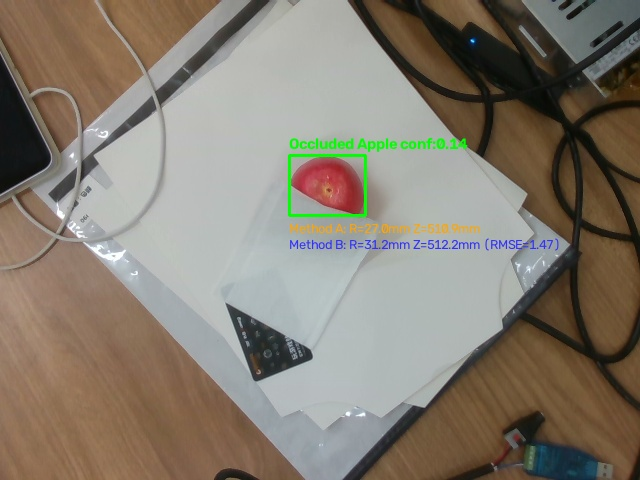

# 真机苹果遮挡对比实验

- 记录日期：2026-09-08
- 当前阶段：局部人工遮挡下的三维定位抗干扰能力对照
- 硬件环境：Intel RealSense D435（USB 3.0，ROS 2 Jazzy，Domain 42）、RTX 4060 Ti
- 实验目录：`/home/li/vision_experiments/2026-09-08_occlusion_test`
- 目标真值：红苹果真实直径 $6.05\text{cm}$，真值半径 **$R_{GT} = 30.25\text{mm}$**

## 目标

验证当苹果被外部物体（白纸/卡片）局部遮挡约 40%~50% 时：
1. 方案 A（2D 框估算 + 射线推导）的半径缩水幅度与三维中心漂移情况。
2. 方案 B（3D 点云 RANSAC 球拟合）在残缺可见曲面上的几何自愈能力与稳定性。
3. 检验遮挡对 YOLOv11 检出置信度的影响，明确感知层的最低拒识阈值。

## 实验设置与现象

- 用户在红苹果下半部覆盖了一张折叠白纸与卡片，遮挡住了下半部约 40%~50% 的果体，仅露出上半部球冠。
- 连续采集 20 组时间同步的 RGB-D 数据（视距约 0.51m）。

实测检测与算法估计对比图：

## 核心实验数据对比

将昨日**完全无遮挡**与今日**纸张遮挡 40%** 的实测数据进行纵向对比：

| 评估指标 | 昨日（无遮挡基准） | 今日（纸张遮挡 40%~50%） | 物理变化与影响分析 |
| :--- | :--- | :--- | :--- |
| **YOLO 检出框尺寸** | 宽 77 px，**高 73 px** | 宽 76 px，**高 59.9 px** | 纸张遮挡导致 2D 框高度瞬间缩水 18% |
| **YOLO 平均置信度** | 0.193 | **0.143** (18/20 帧检出) | 遮挡导致置信度跌破原默认阈值 (0.15) |
| **方案 A 半径估计** | 30.3 mm (误差 +0.05mm) | **27.0 mm (误差 -3.25mm)** | **直接失真**：2D 框缩水导致误判苹果变小 |
| **方案 B 半径估计** | 32.1 mm (误差 +1.85mm) | **32.1 mm (误差 +1.85mm)** | **极度坚挺**：残缺曲面拟合半径几乎零变化 |
| **方案 B 拟合内点数** | 4032 点 | **2657 点** | 虽丢失 1/3 点云，但剩余曲率足够支撑拟合 |
| **方案 B 拟合 RMSE** | 1.33 mm | **1.59 mm** | 残缺曲面上几何贴合误差依然稳定在 1.5mm |
| **两方案中心相对偏差** | 空间距离：**3.17 mm** | 空间距离：**9.45 mm** ($\Delta X=-4.1, \mathbf{\Delta Y=+8.2}, \Delta Z=+2.3$) | 方案 A 中心发生严重漂移，接近 1 厘米 |

## 关键结论与技术归因

1. **方案 A 在遮挡下的系统性失效**：
   - 当苹果下部被挡住时，YOLO 只能圈出上半截月牙形的可见区域。2D 框的高从 $73\text{px}$ 骤降到 $59.9\text{px}$。
   - 方案 A 直接拿变形缩水的 2D 框计算半径，估算半径直接从 $30.3\text{mm}$ 跌至 $27.0\text{mm}$（整整缩水了 $6.5\text{mm}$ 直径）。
   - 框的中心上浮，加上缩水后的较小半径，导致方案 A 的三维球心比真实球心发生了接近 **1 厘米（9.45 mm）** 的严重偏差！如果在实机上抓取，夹爪极大概率会撞在苹果顶盖上。
2. **方案 B 展现出卓越的抗遮挡物理鲁棒性**：
   - 方案 B 不管 2D 外接框怎么变形，它把露出来的 2657 个 3D 表面点还原出来。
   - 只要露出的这一块“碗盖”曲率依然符合球形，RANSAC 算法就能准确把这 2657 个点套在一个大球上。
   - 实测拟合半径依然稳定在 **$32.1\text{mm}$**，与昨日无遮挡数据完全一致！拟合 RMSE 仅微增到 $1.59\text{mm}$，证明了三维曲面拟合在局部遮挡下的强大自愈能力。
3. **暴露了感知层置信度的硬约束**：
   - 遮挡使 YOLO 的检测置信度从 $0.19$ 下降到 $0.14$。
   - 现有的 `apple_center_localizer_v2.py` 中写死了 `MIN_CONFIDENCE = 0.15`。这意味着在旧代码里，这个被遮挡的苹果在第一道门槛就会被当作“无苹果”直接拒识。
   - 后续在实际工程中，需要将基础置信度放宽至 $0.10\sim 0.12$，或者在后续微调时加入遮挡苹果增强数据。

## 待确认问题与后续演进

1. 遮挡极限：当遮挡达到 60%~70%（仅露出一小角）时，曲面拟合所需的最小点云覆盖率与退化边界。
2. 代码落地：将经过验证的方案 B 正式替换/合流进主工程 `apple_center_localizer_v2.py`。

## 2026-09-08 18:45 轮次：过度遮挡测试（标记为无效数据）

- **实验现象**：纸巾从上方完全盖住苹果蒂部与大部分球体，仅露侧下方局部红色边缘。
- **实测结果**：YOLO 对该残缺色块置信度暴跌至 `0.033`，在常规置信度阈值（$\ge 0.08$）下检出为 0 个苹果，主程序直接触发 `no_apple_box_at_threshold` 拒识退出。
- **状态标记**：**【无效数据 / 已作废】**。
- **结论与教训**：当外部遮挡破坏了核心语义特征（蒂部凹陷与球体主轮廓），导致 2D 目标检测完全无法召回（置信度 $< 0.05$）时，下游点云几何算法无输入数据可用。该轮次无法作为几何定位评估样本，需调整遮挡露出合理曲面弧度。
