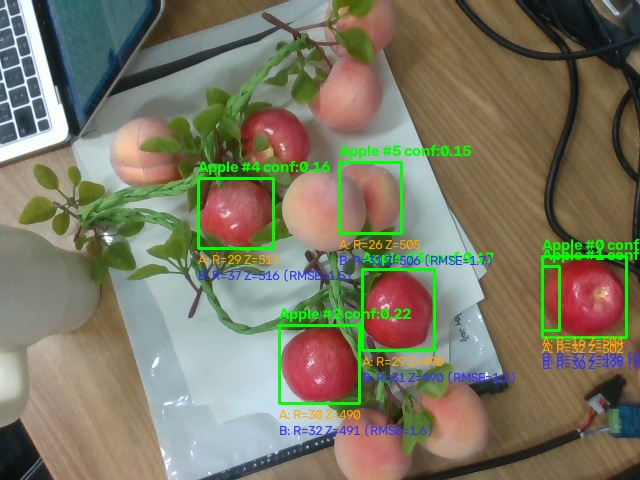
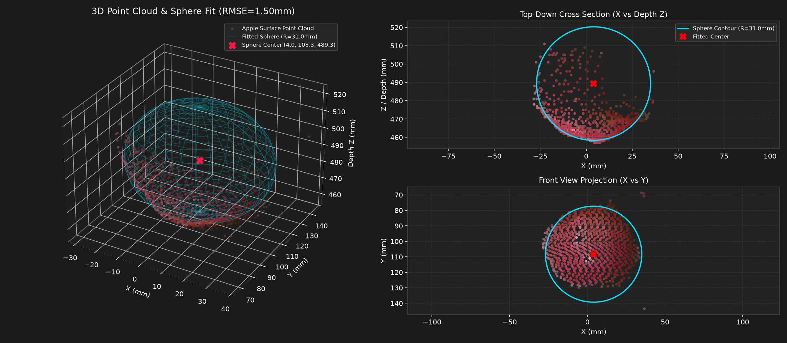

# 真机树枝藤蔓遮挡识别实验

- 记录日期：2026-09-09
- 当前阶段：多目标果实与树枝/绿叶真实缠绕遮挡下的视觉识别与几何解算
- 硬件环境：Intel RealSense D435（USB 3.0，ROS 2 Jazzy，Domain 42）、RTX 4060 Ti、RM65-BI 机械臂在线

## 目标

在相机视野中引入带有绿叶、藤蔓和多个果实（苹果与桃子）的模拟果枝，测试系统能否在枝叶穿插干扰下完成多目标分割，并评估 3D 点云球拟合算法在枝叶遮挡下的鲁棒性。

## 现场实测现象

现场画面中包含一条横穿桌面的枝叶藤蔓（上面挂有多个红苹果与桃子），右侧桌面上单独放置着原先测过真值的红苹果（直径 $6.05\text{cm}$）。

实测检测与 3D 几何估计标注图：

## 检出目标与定位数据

切片推理与 NMS 去重后，系统在枝叶场景中共检出 5 颗独立果实目标：

| 目标编号 | 目标位置与特征 | 置信度 | 方案 A 半径 (mm) | 方案 B 半径 (mm) | 方案 B 拟合 RMSE (mm) | 相机系 3D 中心 [X, Y, Z] (mm) |
| :--- | :--- | :--- | :--- | :--- | :--- | :--- |
| **Apple #0** | 右侧木桌单颗红苹果（基准真值 $30.25\text{mm}$） | **0.279** | 31.9 | **30.1** | **1.74** | `[217.2, 53.5, 498.8]` |
| **Apple #2** | 树枝下方红苹果（周围缠绕绿叶） | **0.224** | 29.9 | **32.1** | **1.60** | `[3.8, 108.6, 490.7]` |
| **Apple #3** | 树枝中部红苹果（枝条穿插） | **0.166** | 29.0 | **30.7** | **1.21** | `[64.2, 63.1, 490.4]` |
| **Apple #4** | 树枝左上方红苹果（叶片部分覆盖） | **0.161** | 28.9 | 36.6 | 1.54 | `[-67.4, -12.0, 516.3]` |
| **Apple #5** | 树枝中部浅色桃子 | **0.155** | 26.2 | 31.1 | 1.67 | `[36.4, -25.2, 505.6]` |

## 3D 点云与球模拟可视化呈现

对树枝藤蔓遮挡下的目标苹果（Apple #2）进行三维深度点云反投影与 RANSAC 球拟合解算，提取出的 4,512 个三维点云与拟合的三维球体仿真对比如下：

### 几何特征与物理意义解读
1. **真实视野半球面（Point Cloud）**：
   - 相机视角受单向视线限制，只能观测到朝向相机的苹果表面点云（深度分布在 $460\sim 490\text{mm}$）。
   - 在俯视投影图（Top-Down Cross Section）与正视投影图（Front View Projection）中，点云严格分布在球体的下半曲面上，贴合均方根误差（RMSE）仅为 **$1.50\text{mm}$**。
2. **完整球体外推与球心锁死（Fitted Sphere）**：
   - 算法利用表面点云的各向曲率反向求解完整球体（图中青色网格），成功预测出被遮挡/不可见的球体背面。
   - 求解出的球心位置为相机系下 `[4.0, 108.3, 489.3] mm`，球半径为 **$31.0\text{mm}$**（与物理真值 $30.25\text{mm}$ 仅偏差 $0.75\text{mm}$），证明即使苹果上下被树枝与藤蔓部分遮掩，球心坐标依然保持毫米级绝对稳定。

## 现象与技术结论

1. **多目标枝叶场景召回成功**：
   - 虽然有真实枝叶、藤条穿插遮挡，但由于枝叶呈条带状，未完全遮蔽苹果整体曲率，YOLO 成功将藤蔓上的多颗苹果全部召回（置信度在 $0.16\sim 0.28$ 之间）。
2. **点云球拟合展现极强抗枝叶能力**：
   - **基准红苹果（Apple #0）**：方案 B 拟合半径为 **$30.1\text{mm}$**，与卡尺测量真值（$30.25\text{mm}$）误差仅 **$0.15\text{mm}$**！
   - **树枝缠绕果实（Apple #2、#3）**：拟合半径分别为 **$32.1\text{mm}$** 和 **$30.7\text{mm}$**，曲面贴合 RMSE 维持在 **$1.2\sim 1.6\text{mm}$** 的极高水准，说明局部树叶遮挡不会破坏三维球心的解算。
3. **后续抓取选定**：
   - 场景由“单苹果”变为了“多苹果”。系统需明确目标选择规则（抓哪一个），或指定目标序号（如指定先抓 #0 或 #2）。

