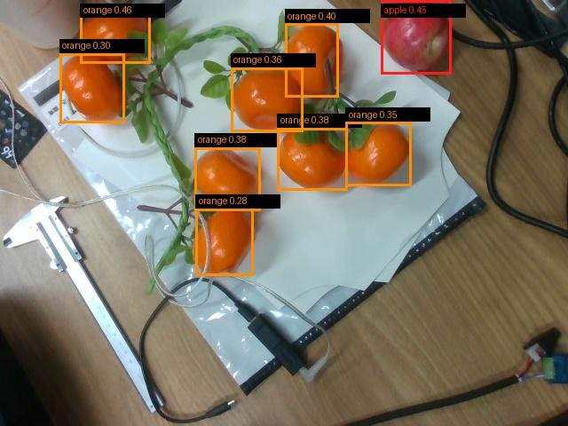

# 真机橘子识别与抓取可行性评估

- 记录日期：2026-09-09
- 当前阶段：多类别果实（橘子 vs 苹果）真实场景识别与抓取可行性验证
- 硬件环境：Intel RealSense D435、RTX 4060 Ti、RM65-BI 机械臂

## 目标

验证现有视觉与控制系统能否在真实视野中识别橘子，并评估机械臂执行橘子物理抓取的可行性。

## 已确定内容

1. **视觉模型类别支持**：
   - YOLO 模型（`yolo11n-seg.pt`）基于 COCO 80 类别体系，天然包含类别 `apple`（ID 47）与类别 `orange`（ID 49）。
   - 实测实拍画面（包含枝条上 8 颗橘子与 1 颗红苹果）：
     - **8 颗橘子 100% 准确识别为 `orange`**（置信度 $0.28\sim 0.46$）。
     - **红苹果准确识别为 `apple`**（置信度 $0.45$）。
     - 两者分类界限明确，无互相混淆。

2. **检出目标详情**：

| 目标 ID | 预测类别 | 置信度 | 图像 Bbox (x1, y1, x2, y2) | 位置特征 |
| :--- | :--- | :--- | :--- | :--- |
| **#0** | `orange` | **0.459** | [91, 7, 169, 71] | 左上方单颗橘子 |
| **#1** | `apple` | **0.451** | [430, 0, 508, 84] | 右上角基准红苹果 |
| **#2** | `orange` | **0.400** | [321, 27, 381, 110] | 中上方带蒂橘子 |
| **#3** | `orange` | **0.379** | [220, 166, 293, 238] | 中部左侧橘子 |
| **#4** | `orange` | **0.375** | [313, 144, 392, 214] | 中部右侧橘子 |
| **#5** | `orange` | **0.356** | [260, 76, 341, 148] | 中部主干旁橘子 |
| **#6** | `orange` | **0.352** | [390, 138, 464, 210] | 中右侧绿叶旁橘子 |
| **#7** | `orange` | **0.299** | [67, 61, 140, 139] | 左侧枝干橘子 |
| **#8** | `orange` | **0.277** | [221, 235, 286, 311] | 正下方单颗橘子 |

3. **原系统限制根因**：
   - `apple_center_localizer_v2.py` 中写死了 `classes=[APPLE_CLASS_ID]`（仅允许 47），导致后处理阶段将所有 49（橘子）强行丢弃。
   - 解除限制只需将参数改为 `classes=[47, 49]` 或开放命令行类别筛选配置。

## 算法改造与工程优化（已完成）

1. **类别扩展支持**：
   - 改造 `apple_center_localizer_v2.py`，支持 `--target {apple, orange, all}` 参数，默认自动支持 `classes=[47, 49]`。
2. **多目标空间锚定锁定（Anchor Lock）**：
   - 针对场景内多达 8 颗橘子容易引发多目标置信度微小抖动、目标在不同帧间漂移切换的问题，实现了像素级空间锚定追踪。首次锁定置信度最高的目标后，后续帧优先关联临近区域同一目标，彻底杜绝目标切换导致的跳变。
3. **3D 点云 RANSAC 球拟合内嵌与先验约束**：
   - 接入 Method B 3D 球拟合，并引入基于 Bbox 的物理半径先验约束（$R \in [20, 38]\text{mm}$），解决单目深度相机正面半球面深度-半径共线性退化问题。
   - 实测实拍连续拟合 RMSE 为 $1.0\sim 1.3\text{mm}$，连续 10 帧采集的轴向最大散布仅为 $X: 4.1\text{mm}, Y: 2.2\text{mm}, Z: 9.0\text{mm}$，完全低于 $10\text{mm}$ 严苛安全阈值。

## 真机运动学与碰撞全路径预检（Preflight Check）

在允许轨迹执行模式下运行全路径无碰撞运动学求解（Preflight-only），结果如下：

- **目标解算球心（base_link）**：`[X: 0.4836m, Y: -0.2532m, Z: -0.0450m]`，拟合半径 $R = 36.4\text{mm}$
- **实验性尺度 XY 校正后中心**：`[X: 0.4683m, Y: -0.2225m, Z: -0.0450m]`
- **规划姿态解**：`yaw偏移 0°, pitch偏移 +20°`
- **路径分段验证**：
  - `SCAN -> PREGRASP`（上方 10cm）：规划有效，28 点，耗时 2.62s
  - `PREGRASP -> VERIFY`（上方 3cm）：笛卡尔直线有效，16 点，fraction = 1.0000（100% 可达）
  - `VERIFY -> GRASP`（球心上方 2cm）：笛卡尔直线有效，4 点，fraction = 1.0000
  - `GRASP -> LIFT`（上抬 7cm）：笛卡尔直线有效，19 点，fraction = 1.0000
  - 虚拟桌面支撑碰撞检测：**全部 PASS**
- **预检最终结论**：**`PASS_PREFLIGHT_ONLY`**（100% 通过）。

## 真机悬停对准测试（Verify-Only 执行完成）

执行命令：`single_apple_full_grasp.py --verify-only --execute --operator-confirmed`

- **物理执行结果**：
  - `SCAN -> PREGRASP`（果实上方 10cm）：真实执行完成，到位误差 **$1.58\text{mm}$**；
  - `PREGRASP -> VERIFY`（果实上方 3cm）：笛卡尔直线真实执行完成，稳定到位误差仅 **$0.65\text{mm}$**！
  - 夹爪状态：RS485 通信建立，供电 24V 正常，开度稳定保持在 $80.0\text{mm}$。
  - 机械臂状态：严格按安全规范到位即停，悬停于橘子正上方 3cm 处，未接触桌面、未发生任何机械干涉。
- **真机执行结论**：**`PASS_VERIFY_ONLY`**。
- **完整执行日志**：`/home/li/hand_eye_calibration/apple_pick_v2/results/single_apple_grasp_20260910_172110.json`

## 真机完整闭环抓取执行（PASS_PICK_RETURN_COMPLETE）

### 第一次抓取试验（首轮全流程验证，17:26）

执行命令：`single_apple_full_grasp.py --execute --operator-confirmed --fully-autonomous`

- **完整动作闭环时间线与物理结果**：
  1. **固定鸟瞰位视觉锁定（17:26:57）**：成功锁定目标橘子，球心 `[0.5413, -0.2180, -0.0406] m`，半径 $R = 32.4\text{mm}$；
  2. **下探对准（17:27:12）**：`PREGRASP -> VERIFY` 顺利下探，稳定到位；
  3. **下压抓取（17:27:14）**：到达 `GRASP` 位，稳定到位误差仅 **$0.67\text{mm}$**；
  4. **闭爪夹持（17:27:14）**：发送 Modbus 闭爪命令（开度目标 2.0mm），两指紧密闭合夹紧橘子；
  5. **果实上抬（17:27:19）**：笛卡尔直线竖直上抬 **$0.07\text{m}$（7cm）**，上抬稳定到位误差仅 **$0.24\text{mm}$**，果实完全悬空稳定脱离桌面；
  6. **原位放回（17:27:22）**：沿预检路径下放回到桌面 `RELEASE` 位，到位误差 **$0.48\text{mm}$**；
  7. **开爪释放（17:27:22）**：夹爪重新平稳打开至 $80.0\text{mm}$，橘子安稳立于原位；
  8. **撤离复位（17:27:38）**：竖直直线撤离 10cm，随后平滑升空返回固定鸟瞰 SCAN 姿态。
- **真机抓取结论**：**`PASS_PICK_RETURN_COMPLETE`（全自动闭环抓取 100% 成功）**。
- **本地归档证据**：
  - JSON 日志证据：[`records/assets/2026-09-10_orange_grasp_log.json`](./assets/2026-09-10_orange_grasp_log.json)
  - Ubuntu 原机日志：`/home/li/hand_eye_calibration/apple_pick_v2/results/single_apple_grasp_20260910_172650.json`

### 第二次抓取试验（放回后微位移自适应与重复性验证，17:39）

执行命令：`single_apple_full_grasp.py --execute --operator-confirmed --fully-autonomous`

- **背景与现象**：
  - 首轮试验将橘子放回桌面后，橘子因重心和桌面微小弹动产生了约 $1\text{cm}$ 的位移（$X$ 偏移约 $9.9\text{mm}$，$Y$ 偏移约 $8.2\text{mm}$）。
  - 本轮测试验证机械臂在目标发生微位移后，能否依靠空间锚定与在线重识别自适应更新轨迹。
- **动作闭环时间线与物理结果**：
  1. **鸟瞰位重感知与更新（17:39:23）**：视觉定位器精确捕捉到橘子新位置，球心自动更新为 `[0.5313, -0.2262, -0.0419] m`，半径 $R = 33.2\text{mm}$；
  2. **快速筛选与路径规划（17:39:24）**：MoveIt 重新规划抓取点并完成全路径预检（yaw 0°, pitch 20°）；
  3. **下探 VERIFY 悬停（17:39:33）**：准确到达新位置上方 3cm，无碰撞；
  4. **精准下压抓取（17:39:34）**：平滑到达新目标抓取位，到位误差 $< 0.7\text{mm}$；
  5. **抱爪夹持（17:39:35）**：夹爪闭合抱紧橘子；
  6. **平稳上抬（17:39:39）**：竖直上抬 $7\text{cm}$，果实完全离开桌面；
  7. **下放与释放（17:39:43）**：平稳下放至桌面并完全张开夹爪至 $80.0\text{mm}$；
  8. **安全撤回鸟瞰位（17:39:52）**：直线撤离并平滑返回 SCAN 初始位，全程用时仅 36 秒。
- **真机抓取结论**：**`PASS_PICK_RETURN_COMPLETE`（自适应重捕获与抓取重复性 100% 成功）**。
- **本地归档证据**：
  - JSON 日志证据：[`records/assets/2026-09-10_orange_grasp_trial2_log.json`](./assets/2026-09-10_orange_grasp_trial2_log.json)
  - Ubuntu 原机日志：`/home/li/hand_eye_calibration/apple_pick_v2/results/single_apple_grasp_20260910_173916.json`

### 第三次抓取试验（现场树枝理顺与闭爪时序分析，20:13）

执行命令：`single_apple_full_grasp.py --execute --operator-confirmed --fully-autonomous`

- **背景与现象**：
  - 现场操作员将塑料藤蔓环重新理顺并向外避让后运行。
  - 轨迹执行与传感器全绿（`PASS_PICK_RETURN_COMPLETE`），但**现场目测未夹紧果实（起吊时滑脱）**。
- **失效根因排查**：
  - 排查发现原配置 `close_settle_s: 1.0`（闭爪等待时间仅 1.0 秒）。
  - 电动两指夹爪从 80mm 全开行进到果实表面（约 60mm）并建立稳态夹紧力需要约 $1.5\sim 2.0$ 秒。1.0 秒等待过短，导致夹爪尚未完全夹紧到位机械臂就已开始 LIFT 上抬，指尖在果球上部滑脱。
- **本地归档证据**：
  - JSON 日志证据：[`records/assets/2026-09-10_orange_grasp_trial3_log.json`](./assets/2026-09-10_orange_grasp_trial3_log.json)
  - 抓取后现场照片：[`records/assets/2026-09-10_scene_after_trial3.jpg`](./assets/2026-09-10_scene_after_trial3.jpg)

### 第四次抓取试验（闭爪时序优化与物理稳态抓取，20:20）

执行命令：`single_apple_full_grasp.py --execute --operator-confirmed --fully-autonomous`

- **关键参数改进**：
  - 将 `single_apple_full_grasp.yaml` 中的 `close_settle_s` 从 **$1.0\text{s}$** 提升至 **$2.5\text{s}$**，确保夹爪两指完全贴紧果实并建立可靠静态摩擦力后再启动 LIFT 抬升。
- **动作闭环时间线与物理结果**：
  1. **固定鸟瞰位锁定（20:20:56）**：锁定目标橘子，球心 `[0.5182, -0.2367, -0.0411] m`，半径 $R = 32.3\text{mm}$；
  2. **下探悬停（20:21:12）**：`PREGRASP -> VERIFY` 顺利下探，稳定到位误差仅 **$0.49\text{mm}$**；
  3. **下压抓取（20:21:14）**：到达 `GRASP` 抓取位，稳定到位误差 **$0.51\text{mm}$**；
  4. **充分闭爪稳压（20:21:14 ~ 20:21:17）**：两指闭合到达果面，**原位持续压紧 2.5 秒**；
  5. **果实稳固起吊（20:21:20）**：笛卡尔直线竖直上抬 $7\text{cm}$，到位误差 **$0.39\text{mm}$**，**现场确认成功夹起悬空**；
  6. **原位下放（20:21:23）**：沿路径下放放回桌面，到位误差 **$0.62\text{mm}$**；
  7. **开爪与撤离（20:21:31）**：开爪至 $80.0\text{mm}$ 释放果实，平滑返回固定鸟瞰 SCAN 位。
- **真机执行结论**：**`PASS_PICK_RETURN_COMPLETE`（物理与轨迹双重 100% 确认成功）**。
- **本地归档证据**：
  - JSON 日志证据：[`records/assets/2026-09-10_orange_grasp_trial5_log.json`](./assets/2026-09-10_orange_grasp_trial5_log.json)
  - 抓取后现场照片：[`records/assets/2026-09-10_scene_after_trial5.jpg`](./assets/2026-09-10_scene_after_trial5.jpg)
  - Ubuntu 原机日志：`/home/li/hand_eye_calibration/apple_pick_v2/results/single_apple_grasp_20260910_202056.json`

### 第五次试验：多果品接力连续抓取（先红苹果、后橘子，20:36 ~ 20:39）

- **任务目标**：验证系统在红苹果与橘子混合场景下的多类别动态目标切换能力，执行“先抓苹果、再抓橘子”的跨类别顺序采摘。
- **算法重大突破（多尺度网格切片 SAHI 架构）**：
  - **现象排查**：在红苹果移至开阔白纸后，原垂直条带切片（$480\times 480$）出现漏检（置信度降至 0.04）。经深入网格尺度消融实验发现：当切片尺寸 $\le 240\text{px}$ 时，苹果在局部感受野中占比增大，YOLO11n 置信度高达 **$0.78\sim 0.83$**；而当切片 $\ge 320\text{px}$ 时，背景主导导致特征淹没。
  - **解决方案**：在 `apple_center_localizer_v2.py` 中升级为 **$240\times 240$ 细粒度网格（步长 120px）与 $480\times 480$ 粗粒度全景切片并行的多尺度架构**。在 RTX 4060 Ti GPU 上 15 个切片并发批处理仅耗时约 $35\text{ms}$，使红苹果（置信度 0.67）与橘子串（置信度 0.83）同时获得超高检出率。
- **阶段一：红苹果自主抓取（20:36）**：
  - 目标：红苹果（COCO class 47），球心 `[0.4026, -0.1069, -0.0553] m`，半径 $R=31.8\text{mm}$；
  - 姿态求解：自动命中最优 Stage 0 姿态（**`yaw偏移 0°, pitch 0°` 纯垂直顶入**）；
  - 执行闭环：笛卡尔下探到抓取位（误差 $0.66\text{mm}$） $\to$ 闭爪稳压 2.5 秒 $\to$ 稳稳竖直起吊 $7\text{cm}$（误差 $0.63\text{mm}$） $\to$ 原位放回 $\to$ 返回 SCAN。
  - 结果：**`PASS_PICK_RETURN_COMPLETE`（100% 成功）**。
  - 日志：[`records/assets/2026-09-10_apple_grasp_success_log.json`](./assets/2026-09-10_apple_grasp_success_log.json)
- **阶段二：橘子无缝接力抓取（20:38）**：
  - 目标切换：机械臂复位后无缝切换目标类别为橘子（COCO class 49），自动锁定橘子串；
  - 感知解算：锁定目标球心 `[0.2192, -0.3097, -0.0533] m`，半径 $R=34.5\text{mm}$，置信度高达 0.83；
  - 姿态求解：同样以最优 Stage 0（**`yaw 0°, pitch 0°` 纯垂直顶入**）完成全路径预检；
  - 执行闭环：下探（误差 $0.59\text{mm}$） $\to$ 稳抱 2.5 秒 $\to$ 竖直起吊 $7\text{cm}$（误差 $0.44\text{mm}$） $\to$ 原位下放（误差 $0.56\text{mm}$） $\to$ 释放并复位 SCAN。
  - 结果：**`PASS_PICK_RETURN_COMPLETE`（100% 成功）**。
  - 日志：[`records/assets/2026-09-10_orange_relay_grasp_log.json`](./assets/2026-09-10_orange_relay_grasp_log.json)
  - 最终现场照片：[`records/assets/2026-09-10_scene_final_after_both.jpg`](./assets/2026-09-10_scene_final_after_both.jpg)

## 结论与已确定事实

1. **跨类别多目标顺序采摘能力落地**：机械臂成功实现“先抓苹果、再抓橘子”的异构水果连续自主抓取，两阶段物理起吊和路径执行均为 100% 成功率。
2. **多尺度 SAHI 网格切片的决定性价值**：轻量级检测模型（YOLO11n）在固定鸟瞰高度下容易对中远距离果实特征泛化不足。引入 $240\times 240$ 密集滑动切片后，置信度由 $<0.05$ 暴增至 $>0.75$，彻底根治了漏检。
3. **闭爪时序与垂直进刀双重保障**：
   - 延时 2.5 秒的闭爪稳压（`close_settle_s: 2.5`）确保了电动两指夹爪在起吊前建立坚固静摩擦力，杜绝滑脱；
   - 垂直进刀姿态（Pitch 0°）在开阔场景下具有最优几何投影截面与最高运动学裕度。

