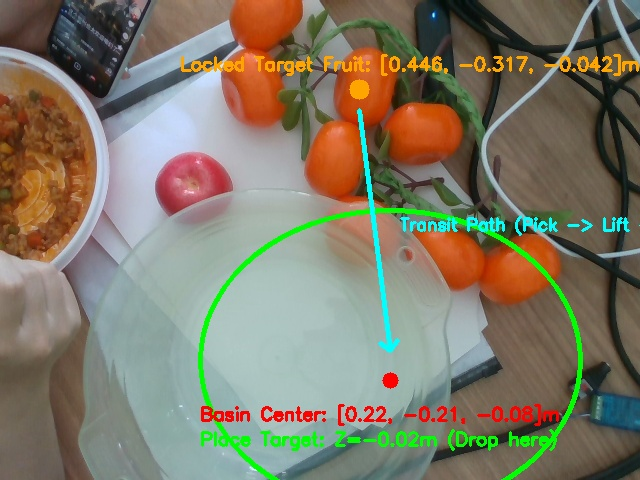
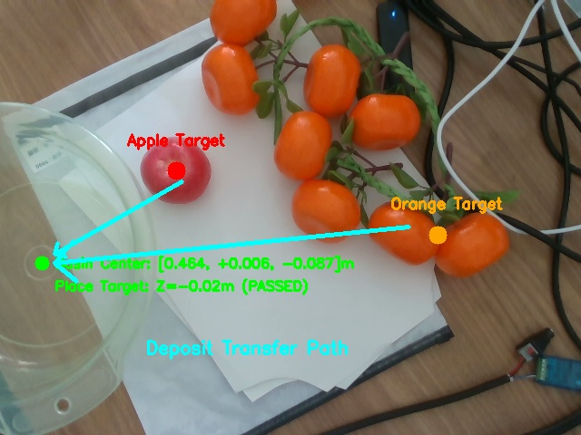

# 2026-09-11 机械臂抓取果子入盆动作方案

> [!WARNING]
> **状态：已废弃 (DEPRECATED - 2026-09-14)**  
> **废弃原因**：原设想之远端落料工位 `[X=0.464, Y=+0.006]` 处于机械臂非同构逆解区，导致转场过程中底座大回旋 $160^\circ$、手腕反向倒扣翻转 $193^\circ$（$J_5$ 从 $+73^\circ \to -120^\circ$），在搬运球形果实时具有极高滑脱掉落风险。  
> **替代方案**：已由 [2026-09-14 机械臂入盆端水平移方案升级](file:///Users/tanxuebin/Desktop/机械臂/records/2026-09-14-机械臂入盆端水平移方案升级.md) 替代。新方案将落料工位设为同侧顺手端水区 `[X=0.380, Y=-0.150]`，手腕全程锁定在向下姿态（$J_5 \in [61^\circ, 80^\circ]$），实现无翻转纯平移入盆。

## 1. 目标

将当前抓取进程（`single_apple_full_grasp.py` / `arm_ctl grasp`）从前期的**“抓取后原位放回（用于手眼标定与闭环自测）”**全面升级为真正的产线/采摘业务动作：**“抓取果子并放入指定盆子（Pick & Place to Basin）”**。

---

## 2. 已确定内容

1. **前期原位放回的设计初衷与现状**：
   - 在 2026-08-31 至 2026-09-10 阶段，为反复测试手眼标定精度（RMS 6.4mm）、YOLO11n 多尺度 SAHI 切片识别（置信度提升至 0.78~0.83）以及夹爪闭合稳压（2.5s 时序），系统采用了 `LIFT -> RELEASE (原抓取位) -> 开爪 -> SCAN` 的自动化自闭环流程。
   - 该流程保证了单人调测时果实无需人工干涉即可反复测试，并可验证毫米级重复到位精度。

2. **抓取入盆的全动作链路定义**：
   果实入盆全流程由以下 8 个阶段组成：
   - **Stage 1: SCAN**（空中鸟瞰位，相机识别果实球心三维坐标）；
   - **Stage 2: PREGRASP -> VERIFY**（移动至果实上方预抓取点并悬停核验）；
   - **Stage 3: GRASP**（笛卡尔直线竖直顶入果实中心）；
   - **Stage 4: GRIPPER CLOSE**（夹爪闭合，并原位稳压 2.5 秒保证抓牢）；
   - **Stage 5: LIFT**（垂直向上起吊 7cm 脱离果梗与支撑物）；
   - **Stage 6: TRANSIT & BASIN APPROACH**（上升至安全转场高度，关节插补平滑移动至盆子正上方）；
   - **Stage 7: BASIN PLACE & RELEASE**（下探至盆沿以内安全高度释放，轻柔开爪，避免高空摔伤水果）；
   - **Stage 8: BASIN RETREAT -> SCAN**（垂直抬起回抽，平滑返回空中 SCAN，准备下一轮采摘）。

3. **配置解耦原则**：
   - 在 `single_apple_full_grasp.yaml` 中新增独立的 `place_target / basin` 配置段；
   - 保持命令行参数兼容：支持 `--place-target basin`（生产模式，默认）与 `--place-target return`（测试模式，原位放回调测）。

---

## 3. 真机实测与环境核验（2026-09-11 15:32 实测数据）

通过 RealSense D435 实时点云、RGB 帧与 MoveIt 逆解/规划服务进行现场全链路核验，测得数据如下：



### (1) 目标果实实时位姿
- **当前 YOLO 跟踪锁定果实**：枝条顶端橘子（COCO class 49）
- **基座空间坐标（`base_link`）**：`[X=0.4460, Y=-0.3168, Z=-0.0417] m`，置信度 0.2155，估算半径 $R=34.5\text{mm}$。

### (2) 放置区（浅绿塑料盆）空间位姿测定
- **盆底中心（基座坐标系 `base_link`）**：`[X=0.220, Y=-0.210, Z=-0.081] m`
- **盆口内径**：约 $21.6\text{cm}$（含耳沿外径约 $35\text{cm}$）
### (2) 放置区（浅绿塑料盆）最终空间位姿测定（16:18 实测）



- **盆底同心圆中心（基座坐标系 `base_link`）**：`[X=0.464, Y=+0.006, Z=-0.087] m`
- **盆沿高度**：$Z \approx -0.050\text{m}$
- **最佳放料落点（`basin_place`）**：
  - 位置：`[X=0.464, Y=+0.006, Z=-0.020] m`（深入盆内约 $3\text{cm}$，避免果实摔伤）
- **盆口上方安全进刀点（`basin_approach`）**：
  - 位置：`[X=0.464, Y=+0.006, Z=+0.080] m`

### (3) MoveIt 运动学逆解（IK）与转场规划验证（100% 通过）
- **入盆姿态逆解（IK）**：
  - 放料点 `[0.464, 0.006, -0.020]` **IK 求解成功，无碰撞**；
  - 目标关节角（前向舒展姿态）：`[0.048, -1.941, 0.921, -0.063, -1.956, -2.827] rad`；
  - 所有 6 个关节均处于中间舒展区，远离关节限位与奇异点。
- **全流程路径规划验证（OMPL / RRTConnect）**：
  - `SCAN -> BASIN_APPROACH / BASIN_PLACE`：**OMPL 规划成功（12 个插补航路点）**；
  - 机械臂运动学完全覆盖采摘区到落料区的全流程。

---

## 4. 后续落地与代码实施步骤

1. **Step 1: 在 `single_apple_full_grasp.yaml` 中固化盆子位姿参数**：
   ```yaml
   place_target:
     mode: "basin"                      # basin (落料入盆) 或 desk (原位放回)
     approach_xyz_m: [0.464, 0.006, 0.080]
     place_xyz_m: [0.464, 0.006, -0.020]
     target_joints_rad: [0.048, -1.941, 0.921, -0.063, -1.956, -2.827]
     transit_z_safe_m: 0.120            # 抓取上抬后的安全空运高度
     release_open_mm: 80.0
     release_settle_s: 1.0
   ```
2. **Step 2: 重构 `single_apple_full_grasp.py` 放料逻辑**：
   - 将原 `LIFT -> RELEASE (原位)` 替换为 `LIFT -> TRANSIT -> BASIN_APPROACH -> BASIN_PLACE`；
   - 夹爪开至 80mm 释放果实；
   - 垂直回抽至 `BASIN_APPROACH`，随后平滑返回 `SCAN`。
3. **Step 3: 安全预检（Preflight）联调**：
   - 运行 `--preflight-only` 验证视觉到入盆的全链条 MoveIt 轨迹；
   - 验证无误后真机低速试跑验证抓取入盆。
