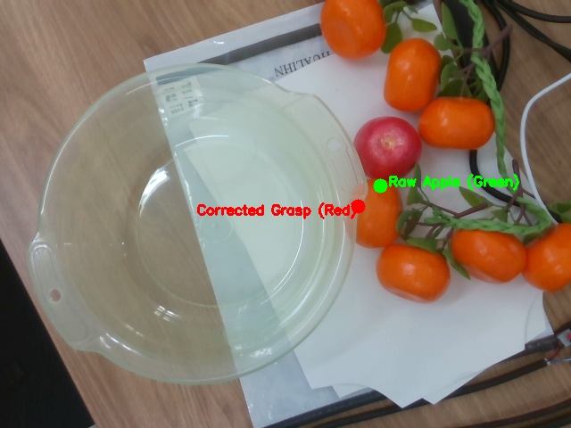
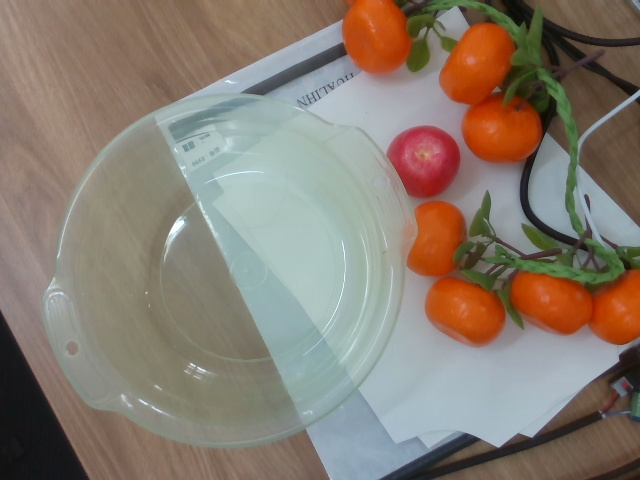
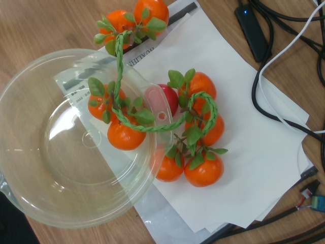
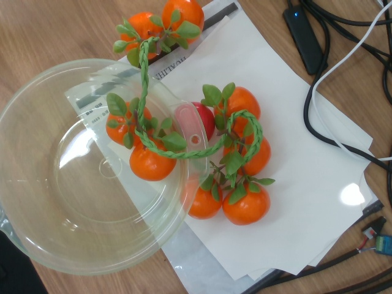

# 复杂果簇与枝叶遮挡采摘工程方案预研

- **记录日期**：2026-09-14
- **当前阶段**：复杂场景真机失败复盘、国内外工程文献调研与后续架构预研
- **涉及硬件**：睿尔曼 RM65-B 6自由度协作机械臂、RS485 Modbus RTU 平口二指夹爪、Intel RealSense D435 深度相机
- **用户核心观点**：
  > “你怎么抓成橘子了，没抓到苹果......不行，单独放没什么意义，因为我们在真实场景中也会有很多干扰的。”  
  > “先保留方案，我们先把干净的情况做好。”

---

## 1. 目标

1. 记录 2026-09-14 真机在“红苹果+柑橘串+假树枝藤蔓”密集簇拥场景下的两次抓取失败现象，彻底查明物理与算法根因；
2. 调研国内外农业采摘机器人（学术界与工业落地公司）在“果实簇拥、枝叶遮挡、障碍规避”上的成熟工程解法；
3. 保留未来攻关多果簇干扰与拓扑采摘的完整技术路线方案；
4. 明确当务之急：建立 100% 稳健的单果无遮挡基线流程（“干净情况做好”），为后续引入遮挡感知算法奠定受控基础。

---

## 2. 真机实验实测记录与根因复盘（已确定内容）

### 2.1 实验一：目标切换红苹果与首次下潜偏移（14:10）
- **实验输入**：
  用户指出此前抓橘子失败的物理原因：“*机器臂的夹爪的一半部分撞到苹果上了，它是软的，变形了，所以只有一半的夹爪机器臂当然抓不起来了橘子了*”，指令切换目标抓取红苹果。
- **现象**：
  机械臂下探至抓取位闭爪，但夹爪落在苹果与橘子之间的缝隙处，仅擦碰到苹果侧壁，苹果轻微滚动，未被夹起。
- **根因证据**：
  - 系统配置中启用了 8 月 10 日拟合的实验性 2D 修正模型（`visual_xy_correction: true`）。
  - 在当前坐标远端（$Y \approx -0.30\text{ m}$），该经验公式带来了 **$+29.5\text{ mm}$ 的人为偏移**，直接将抓取中心从真实的苹果球心（绿色点）拉偏至苹果与橘子之间的缝隙（红色点）。
  - 证据图片：
  - 抓取后现场状态：
  - 执行日志：`single_apple_grasp_20260914_141000.json`

### 2.2 实验二：关闭人为偏移后的真机采摘（14:21）
- **改进措施**：
  永久关闭历史经验 2D 修正（`visual_xy_correction: false`），直接以视觉检测到的真实三维球心（`[0.384, -0.311, -0.053]` m）为目标；将进刀深度由中心上方 20 mm 加深至 10 mm。
- **现象**：
  机械臂精准运动至目标上方，闭爪并顺利完成“端水直落”转场至塑料盆，但在盆中松开夹爪后，**落入盆中的是缠绕在苹果上方的假树枝藤蔓以及挂在上面的 2 颗橘子，红苹果被留在桌面上并被扯乱的藤蔓部分掩埋**。
- **根因证据**：
  1. **逆运动学边界与倾角进刀**：苹果受第一次碰撞后轻微滚动至坐标半径 $R_{xy} \approx 0.494\text{ m}$。在此极限距离下，RM65 手腕纯垂直朝下（Pitch 0°）超出了逆运动学可达范围（`NO_IK`）；MoveIt 规划器自动降级至 Stage 1（**带 $+10^\circ$ 倾角斜向下潜**）。
  2. **感知盲区与障碍不可见**：MoveIt 规划场景中仅建有平整虚拟桌面，环境中的塑料藤蔓与相邻橘子在碰撞体系中完全不可见（规划器视为空气）。
  3. **刚性平口夹爪物理勾挂**：开度 80 mm 的刚性夹爪在倾斜下探时，侧翼直接插入覆盖在苹果上方的编织藤蔓；闭爪时死死夹住韧性塑料藤蔓，起吊时将整串藤蔓和 2 颗橘子一同连根拖入盆中。
  - 证据图片：
  - 当前现场受扰实况：
  - 执行日志：`single_apple_grasp_20260914_142144.json`

---

## 3. 国内外工程方案与文献调研（已确定内容）

针对“果实簇拥、枝叶遮挡、夹爪干涉”这一农业采摘的核心技术瓶颈，国内外学术界与商业产品给出了以下成熟工程路径：

### 3.1 机构与末端执行器维度（解决刚性二指夹爪包络过大问题）
1. **负压吸管/气动吸盘（Vacuum Suction Tube）**：
   - **典型应用**：美国 Abundant Robotics（商业化苹果采摘机）、以色列 Tevel（无人机采摘）。
   - **原理**：末端无横向张开机构，仅一根 30~40 mm 柔性硅胶吸管沿视线直线探入，负压抽气直接吸附果面拔出。完全不需要 80 mm 横向避障空间。
2. **气动鳍条效应柔性手爪（Fin-Ray Soft Gripper）**：
   - **典型应用**：澳大利亚 Monash 大学、Festo 仿生实验室。
   - **原理**：手指采用硅胶/TPU 鱼鳍条结构。碰撞坚硬树枝时，手指被动向内顺从形变（Passive Compliance），顺着枝叶缝隙滑入包覆果实，不与硬障碍物硬抗。
3. **细长手指 + 果梗剪切（Narrow Finger + Stem Shear）**：
   - **典型应用**：中国农业大学、浙江大学。
   - **原理**：手指如筷子般纤细（截面仅 5~8 mm），从果实与枝条极窄缝隙插入，只夹持果梗并剪断，避免大范围触碰果实。

### 3.2 算法与规划控制维度（在现有机械臂+夹爪基础上的解法）
1. **进刀通道点云圆柱体扫描（Corridor Point Cloud Sweeping）**：
   - 利用 RealSense 深度点云，沿候选进刀向量 $\vec{v}$ 构建以夹爪横截面为半径的圆柱体。
   - 过滤目标果实点云后，统计圆柱体内障碍点云数量；若有点云密集，直接判定该方向“物理受阻”，换用其他倾角。
2. **夹爪裂隙自适应对齐（Slit / Gap Alignment）**：
   - 平口夹爪厚度薄（12 mm）但张开宽（80 mm）。
   - 视觉分割计算相邻果实中心连线向量 $\vec{L}$，控制夹爪 Yaw 轴使指尖平面与 $\vec{L}$ 垂直，利用薄片像手术刀一样插入两果间的缝隙。
3. **采摘时序拓扑图（Harvesting Precedence Graph）**：
   - 构建有向无环图（DAG）：外层无遮挡果实优先级高，深层被挡果实依赖外层被移除。
   - 机械臂执行“先外后内、先易后难”的连续采摘，清空外层通道后再采摘内层。
4. **主动物理拨障（Interactive Perception / Push-and-Pick）**：
   - 英国林肯大学（UoL）：夹爪闭合，利用指背轻柔将前排假枝条侧推 3~5 cm 保持，露出后方进刀通道后再探入抓取。

---

## 4. 后续方案规划与分步实施路径

### 4.1 阶段一：打牢干净基线（当前执行，门槛验证）
- **原则**：不急于在感知和规划未具备障碍建模的情况下强行硬抓乱局，避免机械臂拉扯硬件造成设备损伤。
- **执行内容**：
  1. 现场人工理顺被机械臂扯乱的假藤蔓，将红苹果置于机械臂**高灵巧甜点区**（$X \approx 0.38\text{ m}, Y \approx -0.15 \sim -0.20\text{ m}$），确保手腕具备 Pitch 0°（纯垂直朝下）逆解能力；
  2. 确认苹果无遮挡、视觉置信度 $>0.80$；
  3. 执行单苹果抓取、端水平移、入盆释放与回抽，验证 100% 成功率与平稳性闭环。

### 4.2 阶段二：复杂场景算法升级（后续迭代，保留方案）
- **升级点 1**：在视觉端计算果簇主轴方向，输出夹爪最优偏航角（Yaw Slit Angle），实现缝隙插入；
- **升级点 2**：在 MoveIt 中引入点云 octomap 或圆柱体通道碰撞检测，彻底消除“盲眼下潜”；
- **升级点 3**：实现连续接力采摘拓扑逻辑（先抓外层橘子清障入盆，再抓深层苹果）。

---

## 5. 待确认问题与技术备忘

1. **甜点工作区标定**：需通过几何网格测试，精确标定 RM65 在垂直向下姿态下的最大有效抓取半径 $R_{max}$（当前已知 $R \ge 0.49\text{ m}$ 时 Pitch 0° 无逆解，安全半径约为 $0.32 \sim 0.42\text{ m}$）。
2. **夹爪力控与柔顺性**：当前 Modbus 夹爪为纯位置控制（开度 2.0 mm 强行闭合堵转），缺乏抓取力传感，抓取质地偏软的仿真果实时容易导致果实形变位移。后续可评估增加柔性指套（硅胶保护套）增加接触摩擦力。
