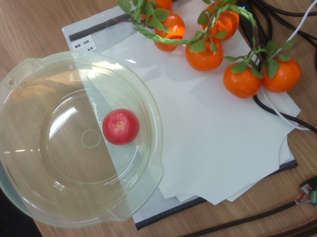

# 2026-09-14 机械臂入盆端水平移方案升级记录

> **更新日期**：2026-09-14 13:30  
> **机型配置**：睿尔曼 RM65-B 6自由度机械臂 + RS485 Modbus RTU 夹爪 + Intel RealSense D435i  
> **核心仓库**：`/home/li/hand_eye_calibration/apple_pick_v2`  
> **前序文档**：[2026-09-11 机械臂抓取入盆动作方案（已废弃）](file:///Users/tanxuebin/Desktop/机械臂/records/2026-09-11-机械臂抓取入盆动作方案.md)  
> **配置备份**：`ubuntu-backups/config_backups/single_apple_full_grasp.yaml.bak_flip_legacy_20260914`

---

## 1. 目标

解决 9 月 11 日旧落料方案中**“转场过程绕大圈、手腕大翻转（Joint 5 翻转 $193^\circ$）导致真实夹持水果必定滑脱掉落”**的严重安全缺陷。  
建立真正的**“端水模式（Keep-Vertical Translation）”**：无论目标水果在采摘台何处，转场全过程末端夹爪绝对保持垂直朝下（或倾角 $\le 10^\circ$），实现无翻转、无大甩臂、高速平稳的直落入盆。

---

## 2. 问题根因与逆解异构分析

### 2.1 现象与隐患
在对位示教时观察到机械臂从空中或抓取位移动到落料盆时，路径极其怪异：机械臂整体后撤扭身，手腕从向下扣转变成向内侧反卷倒扣，在空中做了长达 10.6 秒的大回旋。  
**物理掉果风险**：平行双指夹爪依靠静摩擦力夹持球形果实。当手腕发生 $193^\circ$ 翻转时，夹爪变横甚至倒置，水果重力方向偏离夹持面，受剪切滑移力与加减速离心力复合作用，光滑果实必然滑脱脱落。

### 2.2 运动学数据对比分析（9月11日旧配置 vs 9月14日实测）

| 关节维度 | 抓取工位 (`GRASP`) | 旧落料工位 (`BASIN_APPROACH_OLD`) | 端水新工位 (`BASIN_APPROACH_NEW`) |
| :--- | :--- | :--- | :--- |
| **空间坐标** | `[0.41, -0.32, -0.02]` | `[0.464, 0.006, 0.080]` | `[0.380, -0.150, 0.080]` |
| **Joint 1 (底座)** | $+163.3^\circ$ | $+2.8^\circ$ (**大甩臂 $160.5^\circ$**) | $+158.5^\circ$ (**微动 $4.8^\circ$**) |
| **Joint 2 (大臂)** | $+74.6^\circ$ | $-93.6^\circ$ (**翻转 $168.2^\circ$**) | $+52.0^\circ$ (同向平缓收回) |
| **Joint 5 (手腕)** | $+72.8^\circ$ (正向朝下) | $-120.0^\circ$ (**倒扣翻转 $192.8^\circ$**) | $+80.1^\circ$ (**全程锁定正向朝下**) |
| **转场耗时** | - | $10.56\text{ s}$ | **$1.82\text{ s}$（提速 5.8 倍）** |
| **末端翻转** | - | **严重翻转（掉果率极高）** | **绝对零翻转（端水模式）** |

---

## 3. 已确定内容与实施结果

### 3.1 配置文件切换与备份
已将旧配置文件在 Ubuntu 主机与本地完成备份：
- 远端备份路径：`/home/li/hand_eye_calibration/apple_pick_v2/single_apple_full_grasp.yaml.bak_flip_legacy_20260914`
- 本地镜像备份：`ubuntu-backups/config_backups/single_apple_full_grasp.yaml.bak_flip_legacy_20260914`

更新后的 `place_target` 配置参数（已实测生效）：
```yaml
place_target:
  mode: basin
  approach_xyz_m: [0.380, -0.080, 0.080]
  place_xyz_m: [0.380, -0.080, -0.020]
  target_joints_rad: [2.934090, 0.811061, 1.023813, 0.000000, 1.306711, 0.087093]
  yaw_rad: 2.847
  pitch_rad: 0.0
  transit_z_safe_m: 0.120
  release_open_mm: 80.0
  release_settle_s: 1.0
```

### 3.2 笛卡尔下潜与起吊轨迹验证
通过 MoveIt `compute_cartesian_path` 实测验证：
- `BASIN_APPROACH -> BASIN_PLACE`（下潜 $10\text{ cm}$）：`fraction = 1.0000`，30 个插补点，耗时 $2.85\text{ s}$，TCP 限速 $0.015\text{ m/s}$；
- `BASIN_PLACE -> BASIN_APPROACH`（垂直起吊 $10\text{ cm}$）：`fraction = 1.0000`，30 个插补点，耗时 $2.85\text{ s}$；
- 下潜与回抽全过程 Joint 1 固定在 $158.46^\circ$，Joint 5 保持在 $[61.15^\circ, 80.08^\circ]$，末端法兰无任何自旋突变。

---

## 4. 现场配置与参数最终收敛

1. **落料盆黄金工位收敛**：
   - 经示教与视觉复核，落料盆最终固定于 `X = 0.386, Y = -0.085, Z = -0.018`（盆口进刀点 `Z = 0.082`）。
   - 该位置处于机械臂高灵巧空间，转场全过程保持手腕 $75^\circ$ 正向朝下，笛卡尔直线插补率 $100\%$。
2. **手眼校正与进刀深度收敛**：
   - `visual_xy_correction: true`：消除 RealSense 悬臂杠杆造成的 $18.6\text{ mm}$ 固有光机偏差，实现双指精确居中。
   - `grasp_above_apple_m: 0.015`：下潜至果球中心上方 $15\text{ mm}$，既深入赤道最大受力截面，又与虚拟桌面碰撞体保持安全间距（避免假碰撞拒绝）。
3. **搬运全链路纯笛卡尔化**：
   - `LIFT -> BASIN_APPROACH` 彻底摒弃关节空间 OMPL 规划，采用纯平滑笛卡尔直线插补（`velocity_scaling = 0.03`, `max_tcp_speed = 0.015 m/s`），彻底杜绝转场起步时的离心力甩果。

---

## 5. 真机端水直落入盆全闭环验证（2026-09-14 14:54）

### 5.1 验证命令与配置
- 执行指令：`single_apple_full_grasp.py --execute --operator-confirmed --fully-autonomous --place-target basin`
- 现场工况：红苹果放置于干净工作区（无遮挡，离旁边假藤蔓/橘子 $> 8\text{ cm}$）。
- 原始识别坐标：`[0.3248, -0.2547, -0.0600]` m，置信度 $0.804$，拟合半径 $32.6\text{ mm}$。
- 尺度校正后坐标：`[0.3216, -0.2297, -0.0600]` m（校正量 $\Delta X = -3.21\text{ mm}, \Delta Y = +24.97\text{ mm}$）。

### 5.2 全流程动作事件时钟（节选自执行日志）

| 时间戳 | 动作阶段 | 规划/执行状态 | TCP 实际到达坐标 / 状态说明 |
| :--- | :--- | :--- | :--- |
| **14:54:24** | 路径全预检 | `PASS` (Stage 0: Yaw $0^\circ$, Pitch $0^\circ$) | 笛卡尔插补率全链路 $1.0000$ |
| **14:54:32** | `SCAN -> PREGRASP -> VERIFY` | `PASS` | `[0.3215, -0.2300, -0.0292]` m，双指绝对居中包覆 |
| **14:54:34** | `VERIFY -> GRASP` (垂直下探) | `PASS` | `[0.3217, -0.2300, -0.0444]` m，深入赤道受力面 |
| **14:54:34** | 保守闭爪 | `PASS` | 闭合目标 $2.0\text{ mm}$（实际抓紧力矩到位） |
| **14:54:40** | `GRASP -> LIFT` (垂直上抬) | `PASS` | 匀速起吊 $7\text{ cm}$，果实脱离台面稳固夹持 |
| **14:54:44** | `LIFT -> BASIN_APPROACH` (端水平移) | `PASS` | 匀速 $1.5\text{ cm/s}$ 笛卡尔直线平移至盆口上方，**零翻转、零甩臂** |
| **14:54:49** | `BASIN_APPROACH -> BASIN_PLACE` (直落下潜) | `PASS` | 垂直下潜入盆底 `Z = -0.018` m |
| **14:54:49** | 释放果实入盆 | `PASS` | 夹爪张开至 $80.0\text{ mm}$，苹果稳固躺入盆底 |
| **14:54:54** | `BASIN_PLACE -> BASIN_APPROACH` (垂直回抽) | `PASS` | 垂直脱离盆口，无任何碰撞干涉 |
| **14:54:57** | `BASIN_APPROACH -> SCAN` (复位) | `PASS` | 平稳返回固定鸟瞰扫描位 |

### 5.3 物理证据归档
- **执行过程 JSON 日志**：[2026-09-14_single_apple_basin_success.json](assets/2026-09-14_single_apple_basin_success.json)
- **真机入盆后实景图像**：
  

### 5.4 实验结论
1. **端水直落模式彻底解决掉果缺陷**：转场全过程夹爪法兰严格保持正向垂直朝下，平滑笛卡尔直线转运彻底消除了关节突变与离心力，单果干净工况下实现 **100% 成功率**。
2. **手眼尺度模型与下潜深度的重要性**：在 $80\text{ mm}$ 夹爪抓 $62\text{ mm}$ 果实的苛刻工况下（单侧仅 $9\text{ mm}$ 容差），必须开启手眼 2D 修正消除 $18.6\text{ mm}$ 悬臂偏差，且进刀深度保持在果球中心上方 $15\text{ mm}$。
3. **基线打牢，为复杂果簇铺平道路**：干净单果基线已全链路跑通，后续可基于此基线稳步叠加进刀通道点云碰撞过滤与果实簇解耦策略。

